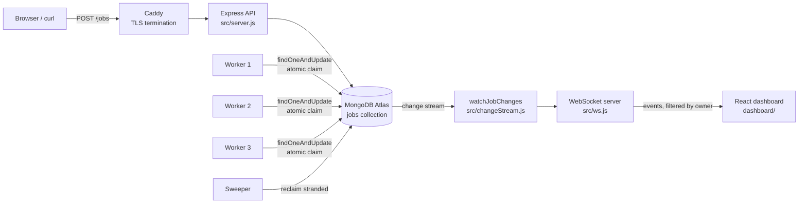

# Distributed Job Queue

**Live: [queue.kumarshourya.me](https://queue.kumarshourya.me)**

A distributed job queue on the MERN stack. Jobs are submitted over an HTTP API, persisted in
MongoDB, claimed and executed by independent worker processes, and streamed live to a React
dashboard over WebSockets.

MongoDB is the queue. No Redis, no RabbitMQ, no broker — the atomicity of a single
`findOneAndUpdate` is what stops two workers claiming the same job.

The deployment runs one API container and **three worker containers** on a single VM. They
share no memory, no locks, and no messages; they coordinate entirely through the database.

---

## Architecture



### Request flow

1. `POST /jobs` → session or API-key auth → rate limit → Zod validation → `createJob()`
   inserts a document with `status: "pending"` and the caller's `ownerId` → `202 Accepted`.
   The API never runs the work; it records the intent.
2. A worker polls each second. `findOneAndUpdate({ status: "pending", runAt: { $lte: now } },
   { status: "claimed", claimedAt: now })` is one atomic operation, so exactly one claimer wins
   each job no matter how many are running.
3. `claimedAt` doubles as a **fencing token**. Every later write matches on it, so a worker
   that lost its lease mid-job cannot overwrite the result of the worker that took over.
4. On success → `completed`. On a transient error → `attempts += 1` and back to `pending` with
   exponential backoff and jitter. On a `PermanentError` → straight to `failed`, no retries.
   After `MAX_ATTEMPTS` (3) → `dead`.
5. A crashed worker leaves its job in `claimed`. The sweeper runs every 5s and returns anything
   claimed longer than `LEASE_MS` back to `pending`.
6. Every write fires a change stream event, filtered by `ownerId` and pushed to that user's
   dashboard over WebSocket.

### Job state machine

```
                 ┌──────────── retry, backoff (attempts < 3) ────────┐
                 │                                                   │
   [new] ──► pending ──► claimed ──► completed                       │
                 ▲          │                                        │
                 │          ├──► (transient error) ────────────────► ┘
                 │          │
                 │          ├──► (PermanentError) ──► failed
                 │          │
                 │          └──► (attempts >= 3) ───► dead
                 │
                 └──── sweeper reclaims after LEASE_MS stranded ──── claimed
```

`failed` and `dead` are different on purpose. `failed` means *this will never work* — a blocked
URL, an unknown job type. `dead` means *we tried three times and gave up*. Only `dead` and
`failed` jobs can be retried from the API.

---

## What it does

| | |
|---|---|
| **Atomic claiming** | One `findOneAndUpdate`. Verified against a naive find-then-save, which produced 8 winners for one job where this produces 1 |
| **Fencing tokens** | `claimedAt` is matched on every conditional write, so a lost lease cannot corrupt a result |
| **Retry with backoff** | Exponential with jitter, capped, three attempts, then dead-letter |
| **Permanent vs transient** | `PermanentError` skips retries entirely |
| **Lease recovery** | Sweeper reclaims jobs from dead workers |
| **Scheduling** | `runAt` for future execution, with a configurable ceiling |
| **Priority** | `-10` to `10`, highest first |
| **Idempotency** | `idempotencyKey`, unique **per owner** |
| **Multi-user** | Session auth, per-user job isolation on every read path |
| **Live updates** | Change streams → WebSocket, filtered per user, resumable across reconnects |
| **SSRF protection** | Outbound URLs resolved and checked against loopback, private, link-local and IPv4-mapped ranges; redirects refused |
| **Rate limiting** | Token bucket per IP, ahead of auth |
| **Backpressure** | Separate caps on runnable and scheduled jobs, `503` with `Retry-After` |
| **Retention** | TTL index on `finishedAt`, 3 days |
| **Observability** | Structured JSON logs, `traceId` threaded from the HTTP request into worker logs |

---

## Repository layout

| Path | What it does |
|---|---|
| `src/config/index.js` | Loads `.env`, validates, fails fast on missing `MONGO_URI` / `JWT_SECRET` / `API_KEY` |
| `src/redact.js` | Masks secret-looking header values on every read path |
| `src/models/Job.js` | Job schema plus five indexes — the claim, the filtered list, per-owner idempotency, per-owner listing, and the TTL |
| `src/models/User.js` | Email, name, dob, bcrypt hash (`select: false`) |
| `src/server.js` | Mongo, Express, WebSocket, change stream, static dashboard, graceful shutdown |
| `src/api/jobRoutes.js` | Six job routes, Zod-validated, every read owner-scoped |
| `src/api/authRoutes.js` | Register, login, logout |
| `src/controllers/authController.js` | bcrypt, enumeration-safe responses, constant-time login |
| `src/session.js` | JWT sign/verify, httpOnly cookie options |
| `src/middleware/` | `requireAuth`, `requireSession`, API-key check, token-bucket rate limit, trace ids |
| `src/services/jobService.js` | Every write and scoped read of the jobs collection |
| `src/worker/worker.js` | Claim → execute → complete / retry / dead-letter, with heartbeat and fencing |
| `src/worker/handlers.js` | The handler registry — `http_request`, `send_email`, `fetch_content`, `sleep`, `fail` |
| `src/worker/safeUrl.js` | SSRF guard |
| `src/worker/sweeper.js` | Reclaims stranded jobs |
| `src/changeStream.js` | Watches the collection, resumes with a stored token |
| `src/ws.js` | WebSocket server, origin check, session auth, per-owner broadcast |
| `dashboard/` | Vite + React UI — login, signup, submit form, live table |
| `test/` | 131 tests across 14 files |
| `scripts/purge.js` | Dry-run-by-default bulk delete |
| `DEBUG.md` | Debug journal — every non-obvious failure hit during the build and what it taught |

---

## Setup

### Prerequisites

Node.js 20+, and a MongoDB **replica set** — Atlas free tier is fine. Change streams do not
work on a standalone `mongod`.

### Environment

Copy `.env.example` to `.env` and fill it in. The server refuses to start without
`MONGO_URI`, `JWT_SECRET` and `API_KEY`.

```bash
node -e "console.log(require('crypto').randomBytes(32).toString('base64url'))"
```

Generates a value suitable for both secrets.

> **On `+srv`:** if your network blocks or intercepts DNS SRV lookups (many campus networks
> do), `mongodb+srv://` fails with `querySrv ECONNREFUSED`. Use the non-SRV form with shard
> hostnames listed explicitly.

### Run it

```bash
npm install
npm start                    # API + WebSocket on :3000
npm run worker               # worker — run as many as you like
```

```bash
cd dashboard && npm install && npm run dev    # dashboard on :5173
```

### Tests

```bash
npm test
```

131 tests. They spawn real server and worker processes against `MONGO_URI_TEST` and assert on
effects — a job written, read back, and compared — rather than on return values. Nearly every
bug this project hit was a silent no-op, so a test that only checks "it didn't throw" would
have missed all of them.

`--test-concurrency=1` is deliberate: files run serially because several wipe the collection.

---

## API

All `/jobs` routes require authentication — either a session cookie or `X-API-Key`.
A session sees only its own jobs; the API key is an operator credential and sees everything.

### Auth

| Route | Notes |
|---|---|
| `POST /auth/register` | `{ email, password, name, dob }`. Answers identically whether or not the email was taken |
| `POST /auth/login` | Sets an httpOnly session cookie. Constant-time regardless of whether the account exists |
| `POST /auth/logout` | Clears the cookie |

### Jobs

| Route | Notes |
|---|---|
| `POST /jobs` | `{ type, payload, runAt?, priority?, idempotencyKey? }` → `202 { id }` |
| `GET /jobs` | `?status=&limit=&cursor=` — keyset pagination on `_id`, newest first |
| `GET /jobs/stats` | Per-status counts plus a total |
| `GET /jobs/:id` | `404` if it isn't yours |
| `POST /jobs/:id/retry` | Only `dead` and `failed`. `404` if it isn't yours |
| `DELETE /jobs/:id` | Only `pending`. `404` if it isn't yours |

`404` rather than `403` is deliberate: a `403` confirms the id exists.

| Status | Meaning |
|---|---|
| `202` | Queued |
| `200` | Idempotency key already seen — same job returned |
| `400` | Failed validation |
| `401` | No valid session or API key |
| `409` | Wrong state for the operation |
| `413` | Body over 16 KB |
| `429` | Rate limited |
| `503` | Queue full — `Retry-After` set |

### Job types

| `type` | Payload | What it does |
|---|---|---|
| `http_request` | `{ url, method?, headers?, body? }` | Sends a JSON request to a public URL. `GET`/`POST`/`PUT`/`PATCH`/`DELETE`, up to 30 custom headers. SSRF-guarded, redirects refused, 10s timeout |
| `send_email` | `{ to, subject, text }` | Sends a plain-text email through Resend. Session-only, and `to` must be the caller's own registered address — the queue is not an open relay |
| `fetch_content` | `{ url }` | Downloads a page, strips tags and scripts, stores the first 10 KB of text. Body read is cut off at 1 MB; only `text/html` and `text/plain` are accepted |
| `sleep` | `{ ms }` | Waits, capped at 30s |
| `fail` | `{ message? }` | Always throws — for exercising retries |

Header values whose name matches `authorization`, `cookie`, `key`, `token`, `secret` or
`password` are stored as given but returned as `[redacted]` from every read path — the
list, the detail, and the WebSocket stream.

```bash
curl -X POST https://queue.kumarshourya.me/jobs \
  -H "Content-Type: application/json" -H "X-API-Key: $API_KEY" \
  -d '{"type":"http_request","payload":{"url":"https://webhook.site/YOUR-ID","body":{"hello":"world"}}}'
```

---

## Docker

```bash
docker compose up --build --scale worker=3
```

One API, three independent workers. Submit a burst and watch the work spread — each job runs
exactly once with no coordination between them.

**Verified on the live deployment:** 6 jobs produced 12 claims split 5 / 4 / 3 across three
worker containers, and individual jobs' retries migrated between containers — attempt 1 on
worker-3, attempt 3 on worker-1. Under load, 1000 jobs across 40 concurrent claimers: 850
completed with each URL hit exactly once, 100 dead with each hit exactly three times, zero
stranded, zero double-runs.

```bash
docker compose logs -f worker
docker compose ps
docker compose down
```

Config comes from your local `.env` at run time. Nothing is baked into the images, and they
run as the non-root `node` user.

### If Mongo won't connect from inside a container

`getaddrinfo EAI_AGAIN` means DNS failed *inside* the container. Containers don't inherit the
host's DNS — Docker Desktop resolves through its WSL2 VM, whose resolver is often stale. The
compose file pins `8.8.8.8` / `1.1.1.1` on both services.

---

## Deployment

Running on an Azure VM (2 vCPU, 1 GB) in Central India, next to the Atlas cluster in Mumbai.
Caddy terminates TLS with an automatically renewed Let's Encrypt certificate and proxies to
the API; the API container isn't published to the host at all.

Express serves `dashboard/dist` from the same origin, which is what lets the session cookie
stay `SameSite=Lax` instead of needing the third-party-cookie treatment browsers are phasing
out. Hashed bundles are cached for a year; API responses are `no-store`.

---

## Known limitations

- **Atlas free tier caps throughput** at ~100 ops/sec and 500 connections. That, not the
  worker count, is the ceiling — past about four workers you buy throttling, not throughput.
- **No revocation on logout.** The JWT stays valid until it expires; clearing the cookie is
  all logout does. Live WebSockets do close at the token's `exp`.
- **DNS rebinding (TOCTOU)** in the SSRF guard: the address is resolved for validation and
  again by `fetch`, so a hostile resolver could answer differently each time.
- **No CI/CD.** Deploying is `git pull` and a compose restart on the VM.
