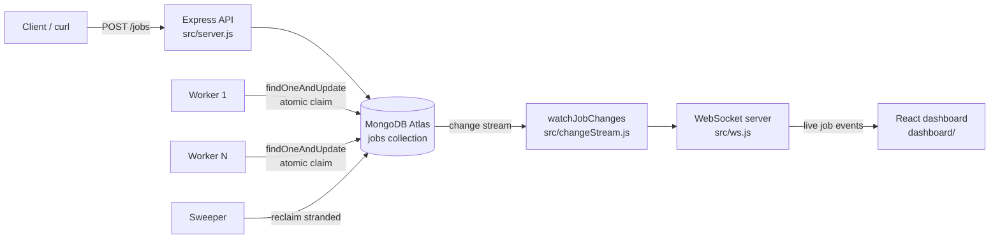

# Distributed Job Queue

A distributed job queue built on the MERN stack: jobs are submitted over an HTTP API,
persisted in MongoDB, claimed and executed by independent worker processes, and streamed
live to a React dashboard over WebSockets.

MongoDB is the queue. There is no Redis, no RabbitMQ, no broker — the atomicity guarantees
of a single `findOneAndUpdate` are what stop two workers from claiming the same job.

---

## Architecture



### Request flow

1. `POST /jobs` → Zod validates the body → `createJob()` inserts a document with
   `status: "pending"` → API returns `202 Accepted` with the job id.
   The API never runs the work; it only records the intent.
2. A worker polls every second. `Job.findOneAndUpdate({ status: "pending" }, { status: "claimed" })`
   is a single atomic operation, so exactly one worker wins each job even with many running.
3. The worker executes the job. On success → `completed`. On failure → `attempts += 1`,
   back to `pending` for a retry, or to `dead` once `MAX_ATTEMPTS` (3) is exhausted.
4. If a worker crashes mid-job the document is stuck in `claimed`. The sweeper runs every
   5 seconds and returns anything claimed for more than 30 seconds back to `pending`.
5. Every write to the collection fires a MongoDB change stream event, which is broadcast
   to all connected dashboard clients over WebSocket.

### Job state machine

```
                 ┌──────────────── retry (attempts < 3) ─────────────┐
                 │                                                   │
   [new] ──► pending ──► claimed ──► completed                       │
                 ▲          │                                        │
                 │          └──► (error) ──────────────────────────► ┘
                 │                    │
                 │                    └──► dead   (attempts >= 3)
                 │
                 └──── sweeper reclaims after 30s stranded ──── claimed
```

---

## Repository layout

| Path | What it does |
|---|---|
| `src/config/index.js` | Loads `.env`, exposes `mongoUri` and `port`, fails fast if `MONGO_URI` is missing |
| `src/models/Job.js` | Mongoose schema: `type`, `payload`, `status`, `attempts`, `result`, `claimedAt`, timestamps. Indexed on `{ status, createdAt }` so the claim query is cheap |
| `src/server.js` | Connects to Mongo, mounts the API, starts the HTTP + WebSocket server and the change stream |
| `src/api/jobRoutes.js` | `POST /jobs` — Zod validation, returns `202` with the new job id |
| `src/services/jobService.js` | `createJob(type, payload)` — the only place that writes new jobs |
| `src/worker/worker.js` | Polling loop: atomic claim → execute → complete / retry / dead-letter |
| `src/worker/sweeper.js` | Reclaims jobs stranded in `claimed` by a dead worker |
| `src/changeStream.js` | Watches the `jobs` collection and forwards every change |
| `src/ws.js` | WebSocket server + `broadcast()` to all connected dashboards |
| `dashboard/` | Vite + React 19 UI: live status counters and a job table |
| `Dockerfile.server` / `Dockerfile.worker` | Two images from the same source tree, different entrypoints |
| `DEBUG.md` | Debug journal — every error hit during the build and how it was resolved |

---

## Setup

### 1. Prerequisites

See [requirements.txt](requirements.txt). Short version: Node.js 20+, a MongoDB **replica set**
(MongoDB Atlas free tier is fine — change streams do not work on a standalone `mongod`).

### 2. Environment

Create a `.env` in the repo root:

```
MONGO_URI=mongodb://<user>:<pass>@<host>:27017/jobqueue?authSource=admin
PORT=3000
```

> **Note on `+srv`:** if you are on a network that blocks or intercepts DNS (many campus
> networks do), the `mongodb+srv://` form fails with `querySrv ECONNREFUSED`. Use the
> non-SRV form with the shard hostnames listed explicitly. This is documented in `DEBUG.md`.

### 3. Install and run

```bash
npm install
node src/server.js      # terminal 1 — API + WebSocket on :3000
node src/worker/worker.js   # terminal 2 — worker (run as many as you like)
```

```bash
cd dashboard
npm install
npm run dev             # terminal 3 — dashboard on :5173
```

### 4. Submit a job

```bash
curl -X POST http://localhost:3000/jobs -H "Content-Type: application/json" -d '{"type":"send_email","payload":{"to":"a@b.com"}}'
```

PowerShell aliases `curl` to `Invoke-WebRequest`, which takes different flags:

```powershell
Invoke-RestMethod -Uri http://localhost:3000/jobs -Method Post -ContentType "application/json" -Body '{"type":"send_email","payload":{"to":"a@b.com"}}'
```

To watch the retry and dead-letter path, submit a job that is designed to fail:

```bash
curl -X POST http://localhost:3000/jobs -H "Content-Type: application/json" -d '{"type":"send_email","payload":{"shouldFail":true}}'
```

---

## Docker

```bash
docker build -f Dockerfile.server -t jobq-server .
docker build -f Dockerfile.worker -t jobq-worker .

docker run -p 3000:3000 -e MONGO_URI="<your-uri>" jobq-server
docker run -e MONGO_URI="<your-uri>" jobq-worker
```

Scaling workers is just running the worker image more than once — the atomic claim makes
that safe with no coordination between them.

---

## API

### `POST /jobs`

```json
{ "type": "send_email", "payload": { "to": "a@b.com" } }
```

| Field | Type | Required | Notes |
|---|---|---|---|
| `type` | string | yes | Non-empty. Identifies what work to do |
| `payload` | object | no | Defaults to `{}`. Arbitrary job input |

| Status | Meaning |
|---|---|
| `202 Accepted` | Job queued. Body: `{ "id": "<job id>" }` |
| `400 Bad Request` | Body failed Zod validation |
| `500` | Unhandled error (Express 5 forwards rejected async handlers to the error middleware) |

---

## Current limitations

Known and deliberate — this is a learning project built in stages.

- **Read API is missing.** There is no `GET /jobs` or `GET /jobs/:id`. The dashboard only
  sees jobs that change *while it is connected*; it has no initial load and loses all state
  on refresh.
- **No authentication** on the API or the WebSocket.
- **Retries have no backoff.** A failing job is retried on the very next tick.
- **`failed` is in the status enum but never used** — failures go straight to `pending` or `dead`.
- **Fixed 1-second poll interval**, no long-polling or push to workers.
- **Single change stream** — it is not resumable, so events during a server restart are lost.
- **No tests.**

## Roadmap

- `GET /jobs` + `GET /jobs/:id`, and a dashboard that loads existing state on mount
- Exponential backoff between retries
- Manual requeue of dead-lettered jobs from the dashboard
- Resumable change stream (persist the resume token)
- Rate limiting, request logging, graceful shutdown
- `docker compose` for the whole stack
- Integration tests against a throwaway Mongo instance
